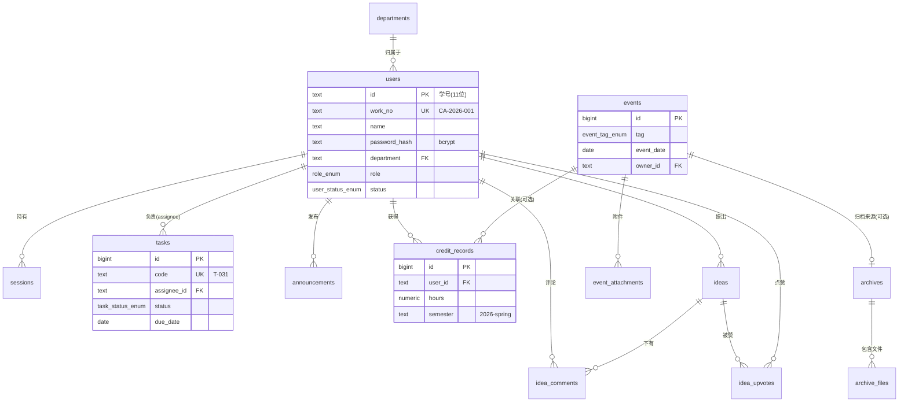

# 数据库设计方案 · PostgreSQL

> 北外创协内部管理系统 · v1.0（2026-07-24）
> 状态：**设计评审稿**，尚未实施。完整 DDL 见 `docs/database/schema.sql`，种子数据见 `docs/database/seed.sql`。

---

## 0. TL;DR

- **选型**：PostgreSQL 16+，9 张核心表 + 4 张关联/日志表 + 1 个统计视图
- **接入方式**：Next.js Server Actions + `postgres.js`，替换 `lib/accounts.ts` 与 `lib/mock/` 的函数实现，页面零改动
- **文件存储**：DB 只存元数据，文件本体走对象存储（Cloudflare R2 / S3）或服务器本地目录
- **部署建议**：Vercel + Neon（Serverless Postgres 免费档），社团规模零成本起步

---

## 1. 选型

| 候选 | 结论 | 理由 |
|------|------|------|
| **PostgreSQL** ✅ | 采用 | 复杂查询能力强、JSONB/枚举/检查约束齐全、开源免费、Server Actions 生态成熟 |
| MySQL | 备选 | 团队若已有 MySQL 运维经验可平替，DDL 仅需小改（枚举 → ENUM/CHECK） |
| SQLite | 否决 | 单写入者、无并发，无法支撑多人同时在线的正式使用 |
| MongoDB 等 NoSQL | 否决 | 数据关系密集（任务↔人↔活动↔学时），关系型是自然选择 |

**部署三选项**（对应 PROGRESS.md 待决策项）：

| 方案 | 成本 | 运维 | 建议 |
|------|------|------|------|
| **Vercel + Neon** ✅ | 免费档够用 | 零运维 | 推荐起步方案，随量伸缩 |
| 自建 VPS + Docker PG | ¥40-80/月 | 需自行备份/监控 | 数据完全自控时的选择 |
| 学校机房 | 免费 | 依赖学校审批与网络策略 | 有渠道再考虑 |

## 2. 规模估算

| 实体 | 量级/年 | 峰值并发 | 结论 |
|------|---------|---------|------|
| 成员 users | 累计 < 500 | — | 单表百万级前无需分区 |
| 活动 events | ~40 | — | 极小 |
| 任务 tasks | ~300 | — | 极小 |
| 学时 credit_records | ~1,500 | — | 极小 |
| 在线会话 sessions | — | < 50 | Neon 免费档（0.25 CU）绰绰有余 |

整体属于**小型 OLTP**：设计重点是正确性、约束与可维护性，而非性能杂技。索引按需配置，不过度设计。

## 3. 总体架构

```
浏览器（React 19 Client Components）
   │  RPC 调用
   ▼
Next.js Server Actions（app/**/actions.ts）
   │  postgres.js（参数化查询，连接池 5-10）
   ▼
PostgreSQL ────────────── 对象存储（R2/S3/本地 uploads/）
（结构化数据 + 文件元数据）    （模板/归档/附件文件本体）
```

- **鉴权**：登录 → bcrypt 校验 → 写 `sessions` 表 → httpOnly cookie（替换现在的 localStorage 登录态）
- **鉴权分层**：DB 不做 RLS，权限判断集中在 Server Actions 入口（角色枚举简单，应用层一处校验即可控；RLS 在直连场景才必要）
- **替换点**：`lib/accounts.ts` 的 8 个函数签名保持不变，内部实现换成 SQL；页面组件零改动

## 4. ERD



（为可读性省略了部分字段与 liaison/templates/feed 三张小表，完整定义见 schema.sql）

## 5. 表清单

| # | 表 | 对应页面 | 对应 mock 数据 |
|---|----|---------|---------------|
| 1 | `departments` | 全局 | types.ts `Department` |
| 2 | `users` | 成员管理 / 登录 | `USERS` + localStorage 注册账号 |
| 3 | `sessions` | 登录态 | localStorage `current-user` |
| 4 | `events` | 日历 / Dashboard / 活动管理 | `EVENTS` |
| 5 | `event_attachments` | 日历详情 | `CalendarEvent.attachments` |
| 6 | `tasks` | 任务看板 | `TASKS` |
| 7 | `announcements` | Dashboard / 公告管理 | `ANNOUNCEMENTS` |
| 8 | `templates` | 资料库 / 模板管理 | `TEMPLATES` |
| 9 | `archives` + `archive_files` | 资料库归档 | `ARCHIVE` |
| 10 | `liaisons` | 外联工作区 | `LIAISONS` |
| 11 | `credit_records` | 学时管理 / 个人中心 | admin/credits 派生数据 |
| 12 | `ideas` + `idea_comments` + `idea_upvotes` | 创意点子库 | `IDEAS` / `IDEA_COMMENTS` |
| 13 | `activity_feed` | Dashboard 动态 | `FEED` |

## 6. 关键设计决策

### 6.1 users 表
- **主键用学号（text）**：学号天然唯一、永不复用，且是登录账号，避免代理键 + 唯一键的双重维护
- `work_no` 保留为展示用工号，唯一约束，`CA-<年>-<3位序号>` 由应用层生成（与现逻辑一致）
- `password_hash`：bcrypt（cost 12），**任何情况下不下发到客户端**
- `status`：`active / removed` 软删除——除名不删行，保留任务/学时历史的引用完整性
- `probation_ends_at`：预备成员 = `join_date + 60 天`，替代 mock 里的静态 `probationLeftDays`，支持秘书处转正审批流

### 6.2 展示用编号
`tasks.code`（T-031）、`templates.code`（TP-01）、`ideas.code`（I-001）保留人类可读编号：
- 主键一律 `BIGSERIAL`，外键引用用主键
- `code` 加唯一约束，由应用层按 `MAX+1` 生成（并发极低，无需序列对象）

### 6.3 学时 credit_records
- 一行 = 一条学时记录（可关联活动，可空），`semester` 文本如 `2026-spring`
- 管理后台「人均/达标」统计走 **`v_credit_totals` 视图**（SUM + FILTER），替代现在前端的硬编码 18.4h

### 6.4 创意点赞
`idea_upvotes(idea_id, user_id)` 复合主键防重复点赞；`ideas.upvotes` 保留冗余计数列（trigger 或应用层维护），列表页免 JOIN

### 6.5 文件本体不入库
`templates.file_key` / `archive_files.file_key` / `event_attachments.file_key` 存对象存储 key，DB 只存元数据（文件名/大小/上传者）。备份时 DB 与文件分开处理

### 6.6 时间字段
- 一律 `TIMESTAMPTZ`（UTC 存储，前端按本地时区渲染，配合 `lib/date.ts` 的 `parseLocalDate`）
- 所有表带 `created_at`；会被编辑的表带 `updated_at`（应用层维护）

## 7. 索引策略

只建服务于已知查询模式的索引（全表数据量小，顺序扫描本来也快，索引主要为约束与 JOIN）：

| 索引 | 服务的查询 |
|------|-----------|
| `sessions(token)` PK + `expires_at` | 每次请求的会话校验、过期清理 |
| `tasks(assignee_id, status)` | 「我的待办」看板 |
| `tasks(due_date)` | 紧急任务筛选（48h 内 DDL） |
| `events(event_date)` | 日历按月取数 |
| `credit_records(user_id, semester)` | 个人学时汇总 |
| `announcements(pinned, published_at DESC)` | Dashboard 置顶公告 |
| `idea_upvotes(idea_id, user_id)` PK | 防重复点赞 |

## 8. 权限模型

权限判断在 Server Actions 入口，与 `lib/auth.ts` 的 `canSeeAdmin / canRemoveMember` 一一对应：

| 操作 | president | vice_president | secretary | head | member/probation |
|------|:---:|:---:|:---:|:---:|:---:|
| 成员管理（增/改） | ✅ | ✅ | ✅ | ❌ | ❌ |
| 除名 | ✅ | ❌ | ❌ | ❌ | ❌ |
| 活动/学时/模板/公告管理 | ✅ | ✅ | ✅ | ❌ | ❌ |
| 预备转正审批 | ✅ | ✅ | ✅ | ❌ | ❌ |
| 任务创建/分配 | ✅ | ✅ | ✅ | ✅（本部门） | ❌ |
| 任务状态流转 | — | — | — | — | ✅（自己的任务） |
| 创意/评论/点赞 | ✅ | ✅ | ✅ | ✅ | ✅ |

## 9. 从原型到数据库的切换步骤

1. **建库**：Neon 建 project → 跑 `schema.sql` → 跑 `seed.sql`（7 个部门 + 初始社长账号）
2. **装依赖**：`bun add postgres`，配置 `DATABASE_URL` 环境变量
3. **写数据层**：`lib/db.ts`（连接池）+ 各 `actions.ts`，按 `lib/accounts.ts` 的 8 个函数签名逐个换成 SQL 实现
4. **迁移已注册账号**：一次性脚本把 localStorage `bfsu-ca:accounts` 导出 → bcrypt 重哈希 → INSERT（量小，手动即可）
5. **逐页替换**：按页面把 `lib/mock/*` import 换成 server action 调用，每换一页验证一页
6. **切除**：`NEXT_PUBLIC_DEMO_MODE=0` → 删 `lib/mock/` → 按编译器报错清理残留（即既定切除流程）

**迁移规范**（实施时遵守）：每次 schema 变更一个文件，`YYYYMMDDHHMMSS_name.up.sql / .down.sql` 成对出现；破坏性变更走 expand-contract（先加 nullable 列 → 回填 → 双写 → 切读 → 删旧列）。

## 10. 备份与安全

| 项 | 方案 |
|----|------|
| DB 备份 | Neon 自动快照（7 天 PITR）；自建则 `pg_dump` 每日 cron + 异地留存 |
| 密码 | bcrypt cost 12；登录失败 5 次锁定 15 分钟（应用层） |
| 会话 | httpOnly + Secure + SameSite=Lax cookie，7 天过期，DB 存 token 哈希 |
| SQL 注入 | postgres.js 参数化查询，禁止字符串拼接 SQL |
| 文件备份 | R2 自带冗余；本地方案则 rsync 每日同步 |

## 附录 · 文件

| 文件 | 内容 |
|------|------|
| `docs/database/schema.sql` | 完整 DDL：枚举 ×8、表 ×13、索引、视图、约束、注释 |
| `docs/database/seed.sql` | 7 个部门 + 初始社长账号（密码需部署时设置） |
